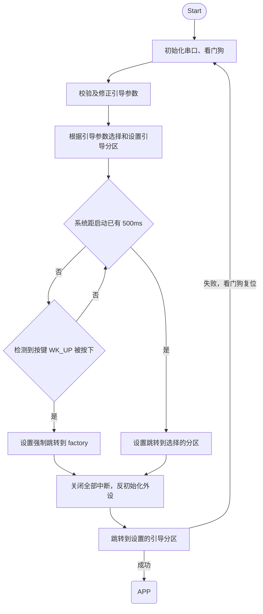
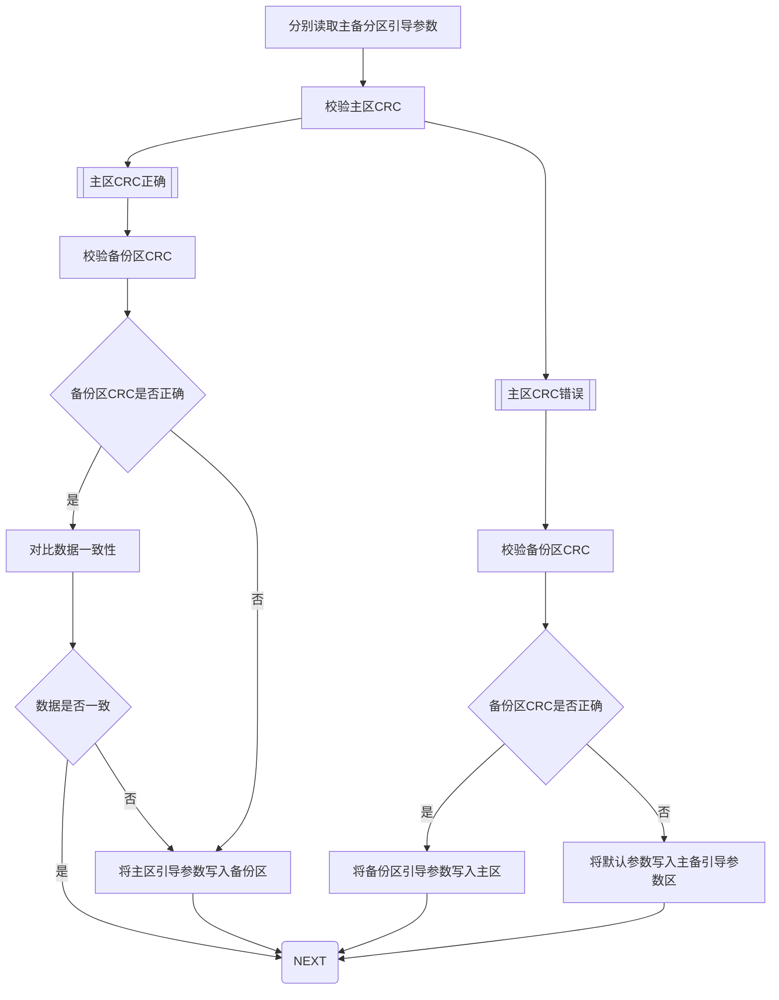
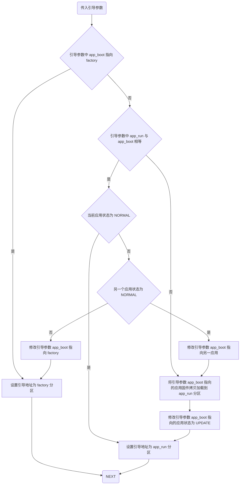
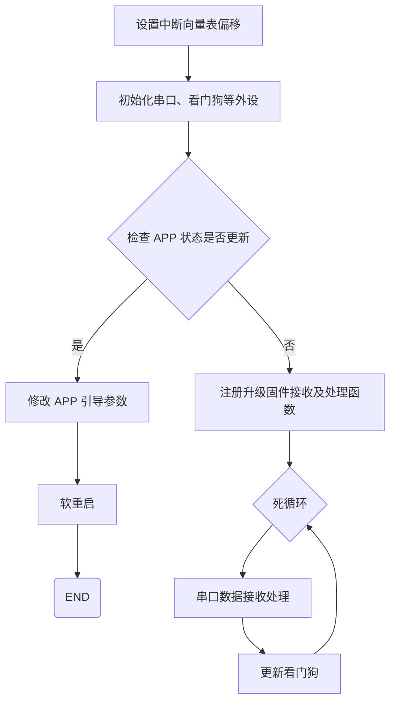
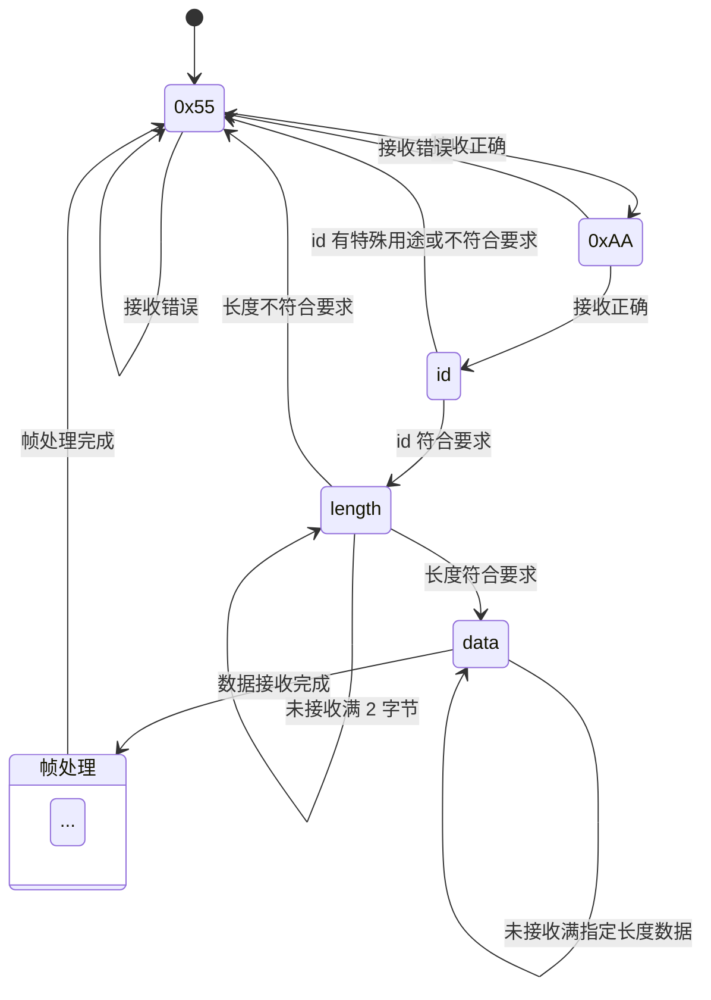
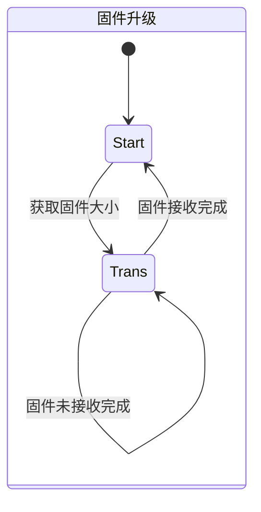
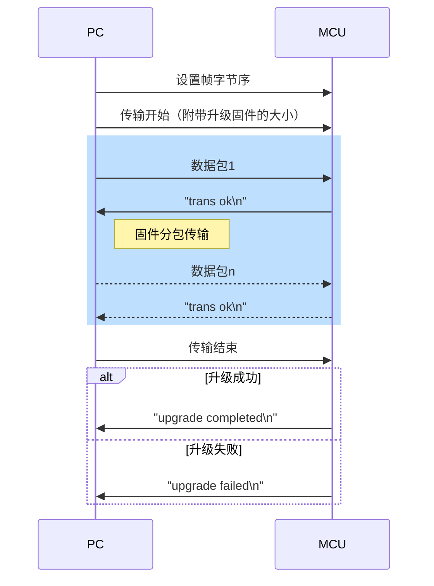
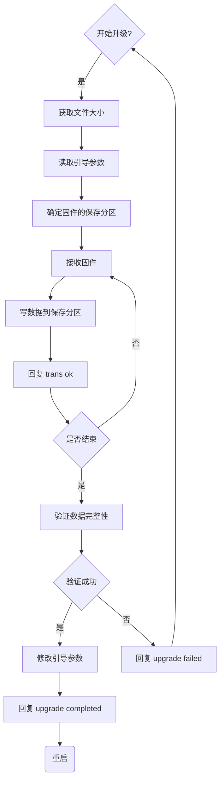

---
markdown:
  image_dir: /assets/other
  path: /README.md
  ignore_from_front_matter: true
  absolute_image_path: true
export_on_save:
  markdown: true
---

# STM32 双 APP 交替 IAP

## 二次开发指南

### 开发环境

硬件：STM32F407ZGT6 或者其它有带 DMA 通道 USART 的单片机 + 1个按键 + LED 指示灯
系统：Windows、Linux、Mac 均可
软件：STM32CubeMX + Segger Embedded Studio 或 arm-none-eabi 交叉编译工具链

*推荐：[Segger Embedded Studio + STM32CubeMX 跨平台开发环境搭建](https://blog.csdn.net/skb666/article/details/131658780)

```bash
# arm-none-eabi
sudo apt install binutils-arm-none-eabi gcc-arm-none-eabi make
# pipenv
python -m pip install pipenv -U
```

### 生成固件

**克隆仓库**

```bash
git clone https://github.com/skb666/stm32f4_iap.git
```

**编译 bootloader、factory、app**

用 `Segger Embedded Studio` 打开 `iap.emProject` 后点击 `Build -> Build Solution` 进行编译，或者分别进入各目录进行编译：

```bash
cd stm32f4_iap
cd bootloader && make -j12 && cd -  # 编译 bootloader
cd factory && make -j12 && cd -     # 编译 factory
cd app && make -j12 && cd -         # 编译 app
```

### 下载引导程序

可以通过 `Segger Embedded Studio` 分别编译下载 bootloader 和 factory 程序，或者：

```bash
cd uart_iap
# 设置虚拟环境
python -m pipenv update
# 合并 bootloader 和 factory
python -m pipenv run python ./merge.py -a ../bootloader/build/bootloader.bin -c ../factory/build/factory.bin -o output.bin
```

在将 `bootloader` 和 `factory` 合并之后，手动使用 `jlink`、`stlink` 等下载器将 `output.bin` 烧入到单片机 FLASH 地址 `0x8000000` 处

### 升级 APP

在编译完 APP 后，用 `USB to TTL` 连接 PC 与 MCU

```bash
python -m pipenv run python ./uart_iap.py -d COM5 -b 921600 -f ../app/emStudio/Output/Release/Exe/app.bin
python -m pipenv run python ./uart_iap.py -d /dev/ttyUSB0 -b 921600 -f ../app/build/app.bin
```

## 升级方案详解

### 前言

IAP (in-application programming) 又叫“应用程序内编程”，对于大多数基于闪存的系统，一个重要的要求是能够在最终产品中安装固件进行更新。  
STM32微控制器可以运行用户特定的固件来对微控制器中嵌入的闪存执行IAP。  
由于不限制通信接口协议等，只要能通过任意通信接口拿到新版固件包数据（bin文件），就能自己升级固件。另外通过添加外部无线模块（WIFI、蓝牙、4G模块）或者使用U盘、TF卡等外部存储设备还可以做OTA升级。

**解决了什么问题？**

1. 现有的 IAP 双 APP 升级方案在编译 APP 需要手动修改 FLASH 地址，大都需要维护两份 APP 代码
2. 在升级 APP 时不再执行其它业务流程，无法进行后台升级
3. 升级完成后会立即重启，用户无法控制

**存在的不完善的地方**

本项目为演示验证以下讲述的方案，使用了尽可能简化的流程，尽量使其易移植、易修改，所以未涉及固件存储安全、固件传输安全等相关的内容。

若需要，大家可以自己移植 ymodem 协议用于接收 bin、添加加解密算法用于保证存储安全等等 :)

### FLASH 分区设计

| 扇区  |  起始地址  |    大小 | 名称       | 成分             |
| :---: | :--------: | ------: | :--------- | :--------------- |
|   0   | 0x08000000 |  0x4000 | bootloader | 升级、引导 APP   |
|   1   | 0x08004000 |  0x4000 | factory    | IAP              |
|   2   | 0x08008000 |  0x4000 | param      | 引导参数         |
|   3   | 0x0800C000 |  0x4000 | param_bak  | 参数备份         |
|   4   | 0x08010000 | 0x10000 | -          | -                |
|   5   | 0x08020000 | 0x20000 | -          | -                |
|  6,7  | 0x08040000 | 0x40000 | app_run    | APP 固定引导位置 |
|  8,9  | 0x08080000 | 0x40000 | app1       | APP + IAP        |
| 10,11 | 0x080C0000 | 0x40000 | app2       | APP + IAP        |

```c
/* FLASH 扇区的起始地址 */
#define ADDR_FLASH_SECTOR_0 ((uint32_t)0x08000000)  // 扇区0起始地址, 16 KB
#define ADDR_FLASH_SECTOR_1 ((uint32_t)0x08004000)  // 扇区1起始地址, 16 KB
#define ADDR_FLASH_SECTOR_2 ((uint32_t)0x08008000)  // 扇区2起始地址, 16 KB
#define ADDR_FLASH_SECTOR_3 ((uint32_t)0x0800C000)  // 扇区3起始地址, 16 KB
#define ADDR_FLASH_SECTOR_4 ((uint32_t)0x08010000)  // 扇区4起始地址, 64 KB
#define ADDR_FLASH_SECTOR_5 ((uint32_t)0x08020000)  // 扇区5起始地址, 128 KB
#define ADDR_FLASH_SECTOR_6 ((uint32_t)0x08040000)  // 扇区6起始地址, 128 KB
#define ADDR_FLASH_SECTOR_7 ((uint32_t)0x08060000)  // 扇区7起始地址, 128 KB
#define ADDR_FLASH_SECTOR_8 ((uint32_t)0x08080000)  // 扇区8起始地址, 128 KB
#define ADDR_FLASH_SECTOR_9 ((uint32_t)0x080A0000)  // 扇区9起始地址, 128 KB
#define ADDR_FLASH_SECTOR_10 ((uint32_t)0x080C0000) // 扇区10起始地址,128 KB
#define ADDR_FLASH_SECTOR_11 ((uint32_t)0x080E0000) // 扇区11起始地址,128 KB
/* 功能分区定义 */
#define ADDR_BOOTLOADER     ADDR_FLASH_SECTOR_0
#define ADDR_APP_FACTORY    ADDR_FLASH_SECTOR_1
#define ADDR_BOOT_PARAM     ADDR_FLASH_SECTOR_2
#define ADDR_BOOT_PARAM_BAK ADDR_FLASH_SECTOR_3
#define ADDR_APP_RUN        ADDR_FLASH_SECTOR_6
#define ADDR_APP_APP1       ADDR_FLASH_SECTOR_8
#define ADDR_APP_APP2       ADDR_FLASH_SECTOR_10
```

**双引导参数分区的作用**

bootloader 或应用修改引导参数分区时断电，若单个区域参数出现问题，双分区互为备份易于自恢复。

**设置 app_run 分区的作用**

作为 APP 的固定引导位置，在编译 APP 时可以将 FLASH 起始地址固定，所以不再需要维护两份应用代码；测试 APP 时也可以方便的将代码下载到该区域进行调试。

有了该分区，应用升级时不再需要直接操作会被引导到的分区，而是 bootloader 根据引导参数来选择性搬运 APP 分区固件到此再跳转，一定程度上避免应用不可控带来的影响，鲁棒性更强。

**设置 factory 分区的作用**

我们先来分方案讨论一下：

1. **app_run + app**：bootloader 将 app 拷贝到 app_run，引导到 app_run；升级 app 时若传输中断可以引导到 app_run，但是若传输成功却无法正常启动则会变砖
2. **app_run + factory + app**：bootloader 初始引导到 factory，通过 factory 升级 app，升级时传输中断或无法正常启动都可以引导回 factory；bootloader 初始引导到 app_run，升级 app 时传输中断则仍然引导到 app_run，若传输成功却无法正常启动则引导到 factory，但无法再处理业务；若正常启动但升级功能出现问题时，可通过 bootloader 强制引导到 factory
3. **app_run + app1 + app2**：bootloader 初始将 app1 拷贝到 app_run，引导到 app_run；升级 app 时若传输中断时仍引导 app_run，传输成功却无法正常启动则引导到原 APP；若正常启动但升级功能出现问题时，可通过 bootloader 强制引导到原 APP
4. **app_run + factory + app1 + app2**：bootloader 初始引导到 factory，通过 factory 升级 app，升级时传输中断或无法正常启动都可以引导回 factory；bootloader 初始引导到 app_run，升级 app 时传输中断则仍然引导到 app_run，若传输成功却无法正常启动则引导到原 APP，仍可以处理业务；若正常启动但升级功能出现问题时，可通过 bootloader 强制引导到 factory

可见上述方案 2、3、4 都可以较好的完成升级任务。对比1、2，在加入 factory 后降低了变砖的可能；对比3、4，加入 factory 可以简化升级逻辑（虽然看着更加复杂），在设备初始时无需烧入 APP，升级调试更加灵活，一致性更好。

在 Flash 空间较小时方案 2 是一个比较好的选择，我这里 stm32f407zg 的 Flash 大小为 1MB，用方案 4 作为演示。

### 引导参数设计

**状态类型**

```c
typedef enum {
  BOOT_FACTORY = 0,
  BOOT_APP1,
  BOOT_APP2,
} APP_BOOT;

typedef enum {
  APP_NONE = 0,
  APP_APP1,
  APP_APP2,
} APP_RUN;

typedef enum {
  STATUS_ERROR = 0,  // APP错误，不能正常工作
  STATUS_UPDATED,    // APP刚更新完成，等待测试启动
  STATUS_NORMAL,     // APP能正常稳定运行
} APP_STATUS;
```

**存储结构**

```c
typedef struct {
  uint8_t app_boot;       // 指示待引导的分区
  uint8_t app_run;        // 指示 app_run 的分区内容来源
  uint8_t app_status[2];  // app1、app2 的分区状态
  uint32_t crc_val;       // 引导参数的 crc 校验值
} BOOT_PARAM;
```

**默认参数**

```c
const uint32_t boot_param_crcdatalen = sizeof(BOOT_PARAM) / 4 - 1;
const BOOT_PARAM boot_param_default = {
    .app_boot = BOOT_FACTORY,
    .app_run = APP_NONE,
    .app_status = {
        [0] = STATUS_ERROR,
        [1] = STATUS_ERROR,
    },
    .crc_val = 0xc704dd7b,
};
```

**参数修改与固化**

参数校验时不包括存储结构中的 CRC 值，通过调用 HAL 库的 CRC 计算函数实现：

```c
static uint32_t param_crc_calc(const BOOT_PARAM *param) {
  uint32_t crc = 0;

  crc = HAL_CRC_Calculate(&hcrc, (uint32_t *)param, boot_param_crcdatalen);

  return crc;
}
```

更新固化参数时重新计算校验值：

```c
static void boot_param_update(uint32_t addr, BOOT_PARAM *param) {
  param->crc_val = param_crc_calc(param);
  STMFLASH_Write(addr, (uint32_t *)param, boot_param_crcdatalen + 1);
}
```

### 引导程序设计

#### 引导流程



看门狗的作用是当跳转 APP 后程序跑飞能复位重新选择启动；只有当 APP 程序正常启动后能重新初始化看门狗及喂狗。

系统启动后在初始的 500ms 内检测指定按键，若指定按键按下则强制引导到 factory 运行。

#### 引导参数校验与修正



主要逻辑实现如下：

```c
void boot_param_read_check(BOOT_PARAM *pdata) {
  BOOT_PARAM param, param_bak;

  STMFLASH_Read(ADDR_BOOT_PARAM, (uint32_t *)&param, boot_param_crcdatalen + 1);
  STMFLASH_Read(ADDR_BOOT_PARAM_BAK, (uint32_t *)&param_bak, boot_param_crcdatalen + 1);

  if (param_crc_calc(&param) == param.crc_val) {
    uart6_printf("boot param checked Ok\n");
    if (param_crc_calc(&param_bak) == param_bak.crc_val) {
      uart6_printf("boot param backup checked Ok\n");
      if (memcmp(&param, &param_bak, sizeof(BOOT_PARAM)) != 0) {
        uart6_printf("boot param main sector and backup sector data are different, update bakup sector data\n");
        STMFLASH_Write(ADDR_BOOT_PARAM_BAK, (uint32_t *)&param, boot_param_crcdatalen + 1);
      } else {
        uart6_printf("boot param main sector and backup sector data are the same\n");
      }
    } else {
      uart6_printf("boot param backup checked Fail, update backup sector data\n");
      STMFLASH_Write(ADDR_BOOT_PARAM_BAK, (uint32_t *)&param, boot_param_crcdatalen + 1);
    }
    memcpy(pdata, &param, sizeof(BOOT_PARAM));
  } else {
    uart6_printf("boot param checked Fail\n");
    if (param_crc_calc(&param_bak) == param_bak.crc_val) {
      uart6_printf("boot param backup checked Ok\n");
      uart6_printf("update main sector data\n");
      STMFLASH_Write(ADDR_BOOT_PARAM, (uint32_t *)&param_bak, boot_param_crcdatalen + 1);
      memcpy(pdata, &param_bak, sizeof(BOOT_PARAM));
    } else {
      uart6_printf("boot param backup checked Fail\n");
      uart6_printf("restore defaults\n");
      STMFLASH_Write(ADDR_BOOT_PARAM, (uint32_t *)&boot_param_default, boot_param_crcdatalen + 1);
      STMFLASH_Write(ADDR_BOOT_PARAM_BAK, (uint32_t *)&boot_param_default, boot_param_crcdatalen + 1);
      memcpy(pdata, &boot_param_default, sizeof(BOOT_PARAM));
    }
  }
}
```

#### 选择和设置引导分区



**固件拷贝加载**

单次拷贝 32KB 数据

```c
#define APP_DATALEN (2 * 128 * 1024)
#define BIN_BUF_DATALEN (8 * 1024)

static uint32_t _CCM_DATA bin_buf[BIN_BUF_DATALEN];

static void load_app(BOOT_PARAM *param) {
  uint32_t read_count = 0;
  uint32_t load_addr = 0;

  if (param->app_boot == BOOT_APP1) {
    load_addr = ADDR_APP_APP1;
  } else if (param->app_boot == BOOT_APP2) {
    load_addr = ADDR_APP_APP2;
  } else {
    return;
  }

  while (read_count < APP_DATALEN) {
    STMFLASH_Read(load_addr + read_count, bin_buf, BIN_BUF_DATALEN);
    STMFLASH_Write(ADDR_APP_RUN + read_count, bin_buf, BIN_BUF_DATALEN);
    read_count += BIN_BUF_DATALEN * 4;
  }

  param->app_run = param->app_boot;
  param->app_status[param->app_boot - 1] = STATUS_UPDATED;
}
```
**引导地址选择及参数修改**

```c
uint32_t select_boot_addr(BOOT_PARAM *param) {
  uint32_t boot_addr = ADDR_APP_FACTORY;
  uint8_t stat_idx;

  if (param->app_boot == BOOT_FACTORY) {
    boot_addr = ADDR_APP_FACTORY;
  } else {
    boot_addr = ADDR_APP_RUN;
    if (param->app_boot != param->app_run) {
      load_app(param);
      boot_param_update(ADDR_BOOT_PARAM, param);
      boot_param_update(ADDR_BOOT_PARAM_BAK, param);
    } else {
      stat_idx = param->app_boot - 1;
      if (param->app_status[stat_idx] == STATUS_NORMAL) {
        return boot_addr;
      } else if (param->app_status[stat_idx] == STATUS_UPDATED) {
        param->app_status[stat_idx] = STATUS_ERROR;
      }

      stat_idx = (stat_idx == 0) ? 1 : 0;
      if (param->app_status[stat_idx] == STATUS_NORMAL) {
        param->app_boot = stat_idx + 1;
        load_app(param);
      } else {
        param->app_boot = BOOT_FACTORY;
        param->app_run = APP_NONE;
        boot_addr = ADDR_APP_FACTORY;
      }
      boot_param_update(ADDR_BOOT_PARAM, param);
      boot_param_update(ADDR_BOOT_PARAM_BAK, param);
    }
  }

  return boot_addr;
}
```

#### 分区跳转

作为 IAP 的最后一步，也是最重要的一步。


1. 在跳转前需要关闭所有的中断，然后反初始化用到的外设。我们的 bootloader 中只初始化了 UART、GPIO 和 IWDG，没有用到中断，所以只需要反初始化这些外设。
2. 从 APP 分区起始地址取中断向量表中栈顶指针地址
3. 栈顶指针地址偏移 4 字节，在中断向量表中取程序入口 Reset_Handler 的函数地址
4. 检测栈顶指针地址是否合法，不合法则重启系统
5. 设置 MSP 指针指向中断向量表的栈顶地址保存的地址
6. 跳转到程序入口，执行 APP

```c
typedef void (*pFunction)(void);
__IO uint32_t MspAddress;
__IO uint32_t JumpAddress;
pFunction JumpToApplication;

inline __attribute__((always_inline)) void start_boot_app(uint32_t boot_addr) {
  MspAddress = *(__IO uint32_t *)(boot_addr);
  JumpAddress = *(__IO uint32_t *)(boot_addr + 4);
  JumpToApplication = (pFunction)JumpAddress;
  if ((MspAddress & 0xFFF00000) != 0x10000000 && (MspAddress & 0xFFF00000) != 0x20000000) {
    NVIC_SystemReset();
  }
  __set_CONTROL(0);
  __set_MSP(MspAddress);
  JumpToApplication();
}
```

上面对于栈顶指针地址的检测，第一个范围为 CCMRAM，第二个范围为 RAM

### 升级程序设计

#### 升级流程



将升级固件接收及处理函数注册到串口处理函数列表后，固件传输和 IAP 作为串口数据处理的里流程。

#### APP 状态检查及参数更新

1. 从引导参数分区读取参数
2. 若当前 app_boot 指代的应用状态为 UPDATE，则将状态修改为 NORMAL 并固化引导参数，否则不进行任何操作
3. 若前面进行了引导参数修改，软件重启系统

```c
void boot_param_check_upgrade(void) {
  BOOT_PARAM param;

  __disable_irq();

  STMFLASH_Read(ADDR_BOOT_PARAM, (uint32_t *)&param, boot_param_crcdatalen + 1);

  if (SCB->VTOR == ADDR_APP_FACTORY) {
    uart6_printf("currently guided to the `factory` partition\n");
  } else if (param.app_boot == BOOT_APP1) {
    uart6_printf("currently guided to the `app1` partition\n");
    if (param.app_status[0] == STATUS_UPDATED) {
      param.app_status[0] = STATUS_NORMAL;
      boot_param_update(ADDR_BOOT_PARAM, &param);
      boot_param_update(ADDR_BOOT_PARAM_BAK, &param);
      uart6_printf("device reboot\n");
      NVIC_SystemReset();
    }
  } else if (param.app_boot == BOOT_APP2) {
    uart6_printf("currently guided to the `app2` partition\n");
    if (param.app_status[1] == STATUS_UPDATED) {
      param.app_status[1] = STATUS_NORMAL;
      boot_param_update(ADDR_BOOT_PARAM, &param);
      boot_param_update(ADDR_BOOT_PARAM_BAK, &param);
      uart6_printf("device reboot\n");
      NVIC_SystemReset();
    }
  }

  __enable_irq();
}
```

#### 串口帧接收及处理

串口的接收与发送基于 [DMA 高速串口收发](/UART.md)

##### 串口帧结构

|   HEAD    |       ID        |        LENGTH        |        DATA        |
| :-------: | :-------------: | :------------------: | :----------------: |
| 0x55 0xAA | 帧类型 (1 Byte) | 数据长度 n (2 Bytes) | 数据内容 (n Bytes) |

相关宏及类型定义：

```c
#define FRAME_DATA_LEN_MAX 1024

typedef enum {
  PARSE_STAT_HEAD1 = 0,
  PARSE_STAT_HEAD2,
  PARSE_STAT_ID,
  PARSE_STAT_LENGTH,
  PARSE_STAT_DATA,
} FRAME_PARSE_STAT;

typedef struct {
  uint8_t status;                     // 状态机状态
  uint8_t id;                         // 帧类型
  uint8_t byte_order;                 // 接收字节序
  uint16_t length;                    // 数据长度
  uint16_t recv_size;                 // 已接收的字节数
  uint8_t data[FRAME_DATA_LEN_MAX];   // 保存数据本体
} frame_parse_t;
```

##### 帧处理函数注册

```c
#define FUNC_LIST_MAX 250

static void _CCM_DATA (*func_list[FUNC_LIST_MAX])(frame_parse_t *);

int8_t frame_parse_register(uint8_t index, void (*func)(frame_parse_t *)) {
  if (func == 0 || index >= FUNC_LIST_MAX) {
    return -1;
  }

  if (func_list[index] == 0) {
    func_list[index] = func;
    return 0;
  } else {
    return -1;
  }
}
```

外部定义帧处理函数，原型为 `void (*func)(frame_parse_t *)`，函数接收一个 `帧指针类型` 的参数，无返回值。

本函数将 id 与 对应的处理函数关联，使串口完成一帧的接收后，可以根据 id 执行对应的处理函数。

##### 接收状态机



**ID 的特殊用途**

将 `0xFF` 与 `0xFE` 保留，用于修改接收数据的字节序。

系统默认小端接收，当 length 完成接收时，若帧字节序为大端，则需要翻转 length。

**完整代码**

```c
void uart6_frame_parse(void) {
  uint16_t size = 0;
  uint8_t rx;

  switch (rx_frame.status) {
    case PARSE_STAT_HEAD1: {
      size = uart6_read(&rx, 1);
      if (size && rx == FRAME_HEAD1) {
        rx_frame.status = PARSE_STAT_HEAD2;
      }
    } break;
    case PARSE_STAT_HEAD2: {
      size = uart6_read(&rx, 1);
      if (size) {
        if (rx == FRAME_HEAD2) {
          rx_frame.status = PARSE_STAT_ID;
        } else {
          rx_frame.status = PARSE_STAT_HEAD1;
        }
      }
    } break;
    case PARSE_STAT_ID: {
      size = uart6_read(&rx_frame.id, 1);
      if (size) {
        if (rx_frame.id == 0xff) {
          rx_frame.byte_order = 1;
          rx_frame.status= PARSE_STAT_HEAD1;
        } else if (rx_frame.id == 0xfe) {
          rx_frame.byte_order = 0;
          rx_frame.status = PARSE_STAT_HEAD1;
        } else if (rx_frame.id < FUNC_LIST_MAX && func_list[rx_frame.id]) {
          rx_frame.status = PARSE_STAT_LENGTH;
        } else {
          rx_frame.status= PARSE_STAT_HEAD1;
        }
      }
    } break;
    case PARSE_STAT_LENGTH: {
      size = uart6_read((uint8_t *)&rx_frame.length + rx_frame.recv_size, sizeof(rx_frame.length) - rx_frame.recv_size);
      if (size) {
        rx_frame.recv_size += size;
      }
      if (rx_frame.recv_size >= sizeof(rx_frame.length)) {
        if (rx_frame.byte_order) {
          change_byte_order((uint8_t *)&rx_frame.length, sizeof(rx_frame.length));
        }
        if (rx_frame.length > FRAME_DATA_LEN_MAX) {
        #ifdef DEBUG
          printf("frame length error!!! (%hu)\n", rx_frame.length);
        #endif
          rx_frame.status = PARSE_STAT_HEAD1;
        } else {
          rx_frame.status = PARSE_STAT_DATA;
        }
        rx_frame.recv_size = 0;
      }
    } break;
    case PARSE_STAT_DATA: {
      size = uart6_read(rx_frame.data + rx_frame.recv_size, rx_frame.length - rx_frame.recv_size);
      if (size) {
        rx_frame.recv_size += size;
      }
      if (rx_frame.recv_size >= rx_frame.length) {
        rx_frame.status = PARSE_STAT_HEAD1;
        rx_frame.recv_size = 0;
        func_list[rx_frame.id](&rx_frame);
      }
    } break;
    default: {
    #ifdef DEBUG
      printf("frame status error!!!\n");
    #endif
    } break;
  }
}
```

#### 固件升级

```c
typedef enum {
  FRAME_TYPE_DATA = 0,
  FRAME_TYPE_BEGIN,
  FRAME_TYPE_END,
  FRAME_TYPE_DEBUG,
  FRAME_TYPE_MAX,
} FRAME_TYPE;
```

对于固件接收及升级功能，我们在主函数进死循环前，要对 “开始”、“传输”、“结束” 等 id 进行注册：

```c
frame_parse_register(FRAME_TYPE_BEGIN, iap_update);
frame_parse_register(FRAME_TYPE_END, iap_update);
frame_parse_register(FRAME_TYPE_DATA, iap_update);
```

**帧处理状态机**



##### 固件传输流程



##### 升级固件接收



> 在读写 FLASH 前后要做好临界区保护。

**完整代码**

```c
void iap_update(frame_parse_t *frame) {
  static BOOT_PARAM param;

  if (!iap_up.enabled) {
    uart6_printf("please reboot first!\n");
    return;
  }

  switch (iap_up.status) {
    case IAP_START: {
      if (frame->id == FRAME_TYPE_BEGIN) {
        __disable_irq();
        STMFLASH_Read(ADDR_BOOT_PARAM, (uint32_t *)&param, boot_param_crcdatalen + 1);
        __enable_irq();
        if (param.app_boot != param.app_run) {
          iap_up.enabled = 0;
        } else {
          if (frame->length != 4) {
            break;
          }
          iap_up.filesize = *(uint32_t *)frame->data;
          if (frame->byte_order) {
            change_byte_order((uint8_t *)&iap_up.filesize, sizeof(iap_up.filesize));
          }
          if (iap_up.filesize % 4) {
            break;
          }
          if (param.app_boot == BOOT_FACTORY) {
            iap_up.target = BOOT_APP1;
            iap_up.addr = ADDR_APP_APP1;
          } else if (param.app_boot == BOOT_APP1) {
            iap_up.target = BOOT_APP2;
            iap_up.addr = ADDR_APP_APP2;
          } else if (param.app_boot == BOOT_APP2) {
            iap_up.target = BOOT_APP1;
            iap_up.addr = ADDR_APP_APP1;
          }
          iap_up.wr_cnt = 0;
          iap_up.status = IAP_TRANS;
        }
      }
    } break;
    case IAP_TRANS: {
      if (frame->id == FRAME_TYPE_DATA) {
        if (frame->length % 4) {
          uart6_printf("iap data length error!\n");
          iap_up.status = IAP_START;
        }
        __disable_irq();
        STMFLASH_Write(iap_up.addr + iap_up.wr_cnt, (uint32_t *)(frame->data), frame->length / 4);
        __enable_irq();
        iap_up.wr_cnt += frame->length;
        uart6_printf("trans ok\n");
      } else if (frame->id == FRAME_TYPE_END) {
        if (iap_up.wr_cnt != iap_up.filesize) {
          iap_up.status = IAP_START;
          uart6_printf("upgrade failed\n");
          break;
        }
        param.app_boot = iap_up.target;
        param.app_run = APP_NONE;
        param.app_status[iap_up.target - 1] = STATUS_ERROR;
        __disable_irq();
        boot_param_update(ADDR_BOOT_PARAM, &param);
        boot_param_update(ADDR_BOOT_PARAM_BAK, &param);
        __enable_irq();
        iap_up.enabled = 0;
        iap_up.status = IAP_START;
        uart6_printf("upgrade completed\n");
        if (SCB->VTOR == ADDR_APP_FACTORY) {
          uart6_printf("device reboot\n");
          NVIC_SystemReset();
        }
      } else {
        ;
      }
    } break;
  }
}
```

##### 升级固件发送

这里使用 python 实现串口发送固件的功能，依赖 `pyserial` 三方库实现的串口收发功能，同一套代码可以方便的在 linux 或 windows 平台执行。

在固件传输前，先定义一个 `uint16_t` 类型的变量，赋值 `0xFFFE`，取出该变量第一个字节，作为 ID 发送给 MCU，来调整发送帧的字节序。

固件发送时，采用分包的策略发送，每个包携带的固件数据长度可以按情况进行自定义，只需长度为 4 的倍数；默认按照每包 1024 字节固件数据来发。

具体代码实现见 [mySerial.py](/uart_iap/mySerial.py)、[uart_iap.py](/uart_iap/uart_iap.py)

### 应用程序设计

应用程序第一步也是最重要的一步，与升级程序第一步一致，也需要设置中断向量表偏移到对应的应用分区首地址。

应用程序可以基于上面升级程序去添加业务实现，升级可在后台进行，通过加大发送升级包的间隔时间、减小单次携带的数据量，可以降低升级对其它逻辑执行的影响。

若应用程序不带升级功能，将升级程序作为 factory，通过 bootloader 强制引导到 factory 也可进行固件升级。

### 内存映射设置

通过修改链接脚本或对应的内存映射文件，使编译生成的目标文件内符号映射到正确的 FLASH 地址，还可用于限制生成目标的大小

**bootloader**

Makefile 链接脚本：[bootloader/STM32F407ZGTx_FLASH.ld](/bootloader/STM32F407ZGTx_FLASH.ld)  
emStudio 内存映射：[bootloader/emStudio/STM32F407ZGTx_MemoryMap.xml](/bootloader/emStudio/STM32F407ZGTx_MemoryMap.xml)

**factory**

Makefile 链接脚本：[factory/STM32F407ZGTx_FLASH.ld](/factory/STM32F407ZGTx_FLASH.ld)  
emStudio 内存映射：[factory/emStudio/STM32F407ZGTx_MemoryMap.xml](/factory/emStudio/STM32F407ZGTx_MemoryMap.xml)

**app**

Makefile 链接脚本：[app/STM32F407ZGTx_FLASH.ld](/app/STM32F407ZGTx_FLASH.ld)  
emStudio 内存映射：[app/emStudio/STM32F407ZGTx_MemoryMap.xml](/app/emStudio/STM32F407ZGTx_MemoryMap.xml)

## 参考链接

1. [STM32CubeIDE IAP原理讲解，及UART双APP交替升级IAP实现](https://blog.csdn.net/sudaroot/article/details/106932736)
2. [IAP技术原理](https://www.yii666.com/article/519050.html)
