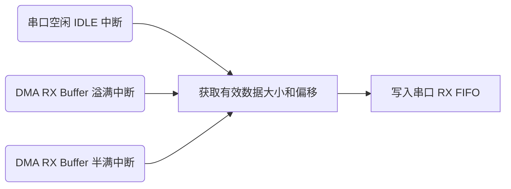
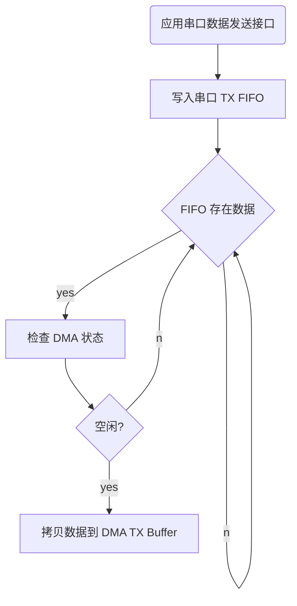

---
markdown:
  image_dir: /assets/other
  path: /UART.md
  ignore_from_front_matter: true
  absolute_image_path: true
export_on_save:
  markdown: true
---

# DMA 高速串口收发

## 前言

直接存储器访问（Direct Memory Access），简称DMA。DMA是CPU一个用于数据从一个地址空间到另一地址空间“搬运”（拷贝）的组件，数据拷贝过程不需CPU干预，数据拷贝结束则通知CPU处理。因此，大量数据拷贝时，使用DMA可以释放CPU资源。DMA数据拷贝过程，典型的有：

+ 内存—>内存，内存间拷贝
+ 外设—>内存，如uart、spi、i2c等总线接收数据过程
+ 内存—>外设，如uart、spi、i2c等总线发送数据过程

**串口有必要使用 DMA 吗**

串口(uart)是一种低速的串行异步通信，适用于低速通信场景，通常使用的波特率小于或等于115200bps。对于小于或者等于115200bps波特率的，而且数据量不大的通信场景，一般没必要使用DMA，或者说使用DMA并未能充分发挥出DMA的作用。  
对于数量大，或者波特率提高时，必须使用DMA以释放CPU资源，因为高波特率可能带来这样的问题：

+ 对于发送，使用循环发送，可能阻塞线程，需要消耗大量CPU资源“搬运”数据，浪费CPU
+ 对于发送，使用中断发送，不会阻塞线程，但需浪费大量中断资源，CPU频繁响应中断；以115200bps波特率，1s传输11520字节，大约69us需响应一次中断，如波特率再提高，将消耗更多CPU资源
+ 对于接收，如仍采用传统的中断模式接收，同样会因为频繁中断导致消耗大量CPU资源

因此，高波特率场景下，串口非常有必要使用DMA。

## 方案设计

关于STM32串口使用DMA，不乏一些开发板例程及网络上一些博主的使用教程。使用步骤、流程、配置基本大同小异，正确性也没什么毛病，但都是一些基本的Demo例子，作为学习过程没问题；实际项目使用缺乏严谨性，数据量大时可能导致数据异常。

**整体框图**


基础代码使用 STM32CubeMX 生成，配置如下

**串口基础参数**


**DMA 通道配置**


**中断优先级**


**串口状态存储结构**

```c
typedef struct {
  volatile uint16_t status; /* 发送状态 */
  uint16_t last_dmarx_size; /* dma上一次接收数据大小 */
  uint32_t tx_count;
  uint32_t rx_count;
} uart_device_t;
```

### 数据流缓存

#### DMA 收发缓存

```c
static uint8_t uart6_dmatx_buf[UART6_DMATX_BUF_SIZE];
static uint8_t uart6_dmarx_buf[UART6_DMARX_BUF_SIZE];
```

#### CPU 处理缓存

使用之前设计的通用环形队列模块 [RING_FIFO](https://github.com/skb666/RING_FIFO) 定义两个 FIFO 作为 CPU 处理部分的缓冲。

```c
static ring_def(uint8_t _CCM_DATA, uart6_tx_ring, UART6_TX_RING_SIZE, 1);
static ring_def(uint8_t _CCM_DATA, uart6_rx_ring, UART6_RX_RING_SIZE, 1);
```

#### CCM 加速数据访问

+ CCM 全称：Core Coupled Memory 。在STM32系列中某些芯片没有CCM，具体需要查看芯片手册。(可以看对应芯片的ld文件，其中如果有对CCM的起始地址和大小的描述的话，那就是拥有CCM)
+ CCM 仅可以由内核进行访问！所以放入CCM中的内容，是不能使用DMA进行访问的！！
+ CCM的优点：将频繁读取的操作放到CCM，或者将中断函数放到CCM，都可以加快程序的执行速度

> 使用CCM的时候需要查看一下对应芯片的总线架构，如果需要需要能够进行数据操作的需要CCM需要挂在D-BUS上，需要指令操作（能调用函数）需要挂在I-BUS上。

**使用方法**

设置宏定义，用于将数据声明在 CCMRAM 中

```c
#define _CCM_DATA __attribute__((section(".ccmram.data")))
```

修改、确认链接脚本中存在以下内容

```c
_siccmram = LOADADDR(.ccmram);

/* CCM-RAM section 
* 
* IMPORTANT NOTE! 
* If initialized variables will be placed in this section,
* the startup code needs to be modified to copy the init-values.  
*/
.ccmram (NOLOAD) :
{
  . = ALIGN(4);
  _sccmram = .;       /* create a global symbol at ccmram start */
  *(.ccmram)
  *(.ccmram*)
  
  . = ALIGN(4);
  _eccmram = .;       /* create a global symbol at ccmram end */
} >CCMRAM AT> FLASH
```

在启动文件中定位到 `bcc FillZerobss`，其后增加

```c
/* Zero fill the ccmram segment. */
  ldr r2, =_sccmram
  b LoopFillZeroCcm

FillZeroCcm:
  movs r3, #0
  str r3, [r2]
  adds r2, r2, #4

LoopFillZeroCcm:
  ldr r3, =_eccmram
  cmp r2, r3
  bcc FillZeroCcm
```

### 串口 DMA 接收

#### 接收总体流程



#### 接收关键配置

```c
/* USART6_RX DMA */
LL_DMA_SetChannelSelection(DMA2, LL_DMA_STREAM_1, LL_DMA_CHANNEL_5);
LL_DMA_ConfigTransfer(DMA2, LL_DMA_STREAM_1,
    LL_DMA_DIRECTION_PERIPH_TO_MEMORY |
        LL_DMA_PRIORITY_HIGH |
        LL_DMA_MODE_CIRCULAR |
        LL_DMA_PERIPH_NOINCREMENT |
        LL_DMA_MEMORY_INCREMENT |
        LL_DMA_PDATAALIGN_BYTE |
        LL_DMA_MDATAALIGN_BYTE);
LL_DMA_ConfigAddresses(DMA2, LL_DMA_STREAM_1,
    LL_USART_DMA_GetRegAddr(USART6),
    (uint32_t)uart6_dmarx_buf,
    LL_DMA_GetDataTransferDirection(DMA2, LL_DMA_STREAM_1));
LL_DMA_SetDataLength(DMA2, LL_DMA_STREAM_1, UART6_DMARX_BUF_SIZE);

LL_DMA_ClearFlag_DME1(DMA2);
LL_DMA_ClearFlag_HT1(DMA2);
LL_DMA_ClearFlag_TC1(DMA2);
LL_DMA_ClearFlag_TE1(DMA2);

LL_DMA_EnableIT_HT(DMA2, LL_DMA_STREAM_1);
LL_DMA_EnableIT_TC(DMA2, LL_DMA_STREAM_1);
LL_USART_EnableIT_IDLE(USART6);

LL_USART_EnableDMAReq_RX(USART6);
LL_DMA_EnableStream(DMA2, LL_DMA_STREAM_1);
```

1. 初始化串口
2. 使能串口 DMA 接收模式，使能串口空闲中断
3. 配置 DMA 参数，使能 DMA 通道 buffer 半传输中断、传输完成中断

很多串口 DMA 模式接收的教程、例子，基本是使用了 **空闲中断** + **DMA传输完成中断** 来接收数据。实质上这是存在风险的，当 DMA 传输数据完成，CPU 介入开始拷贝 DMA 通道 buffer 数据，如果此时串口继续有数据进来，DMA 继续搬运数据到 buffer，就有可能将数据覆盖，因为 DMA 数据搬运是不受 CPU 控制的，即使你关闭了 CPU 中断。  
严谨的做法需要做双 buffer，CPU 和 DMA 各自一块内存交替访问，即是 **乒乓缓存**，处理流程步骤应该是这样:

1. DMA 将数据搬运完成 buffer 的前一半时，产生 **DMA半传输中断**，CPU 来拷贝 buffer 前半部分数据
2. DMA 继续将数据搬运到 buffer 的后半部分，与 CPU 拷贝 buffer 前半部数据不会冲突
3. buffer 后半部分数据搬运完成，触发 **DMA传输完成中断**，CPU 来拷贝 buf 后半部分数据
4. 执行完第三步，DMA 返回执行第一步，一直循环

UART DMA 模式接收配置代码如上，与其他外设使用 DMA 的配置基本一致，留意关键配置：

+ 串口接收，DMA 通道工作模式设为连续模式
+ 使能 DMA 通道接收 buffer 半满中断、溢满（传输完成）中断
+ 启动 DMA 通道前清空相关状态标识，防止首次传输错乱数据

#### 数据接收处理

数据传输过程是随机的，数据大小也是不定的，存在几类情况：

+ 数据刚好是 DMA 接收 buffer 的整数倍，这是理想的状态
+ 数据量小于 DMA 接收 buffer 或者小于接收 buffer 的一半，此时会触发串口空闲中断

因此，我们需根据 **DMA 通道 buffer 大小**、**DMA 通道 buffer 剩余空间大小**、**上一次接收的总数据大小** 来计算当前接收的数据大小。

**DMA 通道 buffer 溢满场景**

接收数据大小 = DMA 通道 buffer 大小 - 上一次接收的总数据大小

```c
/**
 * @brief  串口dma接收完成中断处理
 * @param
 * @retval
 */
void uart6_dmarx_done_isr(void) {
  uint16_t recv_size;

  recv_size = UART6_DMARX_BUF_SIZE - uart6_dev.last_dmarx_size;

  __disable_irq();
  ring_push_mult(&uart6_rx_ring, &uart6_dmarx_buf[uart6_dev.last_dmarx_size], recv_size);
  __enable_irq();

  uart6_dev.rx_count += recv_size;
  uart6_dev.last_dmarx_size = 0;
}
```

**DMA 通道 buffer 半满场景**

接收数据大小 = DMA 通道接收总数据大小 - 上一次接收的总数据大小

DMA 通道接收总数据大小 = DMA 通道 buffer 大小 - DMA 通道 buffer 剩余空间大小

```c
/**
 * @brief  串口dma接收部分数据中断处理
 * @param
 * @retval
 */
void uart6_dmarx_part_done_isr(void) {
  uint16_t recv_total_size;
  uint16_t recv_size;

  recv_total_size = UART6_DMARX_BUF_SIZE - LL_DMA_GetDataLength(DMA2, LL_DMA_STREAM_1);
  recv_size = recv_total_size - uart6_dev.last_dmarx_size;

  __disable_irq();
  ring_push_mult(&uart6_rx_ring, &uart6_dmarx_buf[uart6_dev.last_dmarx_size], recv_size);
  __enable_irq();

  uart6_dev.rx_count += recv_size;
  uart6_dev.last_dmarx_size = recv_total_size;
}
```

**串口空闲中断场景计算**

串口空闲中断场景的接收数据计算与 **DMA 通道 buffer 半满场景** 计算方式是一样的

> 串口空闲中断处理函数，除了将数据拷贝到串口接收fifo中，还可以增加特殊处理，如作为串口数据传输完成标识、不定长度数据处理等等。

**接收数据偏移**

将有效数据拷贝到 fifo 中，除了需知道有效数据大小外，还需知道数据存储于 DMA 接收 buffer 的偏移地址。有效数据偏移地址只需记录上一次接收的总大小即可，在 DMA 通道 buffer 溢满中断处理函数中将数据偏移地址清零，因为下一次数据将从 buffer 的开头存储。

**应用读取串口数据方法**

经过前面的处理步骤，已将串口数据拷贝至接收 fifo，应用程序任务只需从 fifo 获取数据进行处理。前提是，处理效率必须大于 DMA 接收搬运数据的效率，否则导致数据丢失或者被覆盖处理。

### 串口 DMA 发送

#### 发送总体流程



#### 发送关键配置

```c
/* USART6_TX DMA */
LL_DMA_SetChannelSelection(DMA2, LL_DMA_STREAM_7, LL_DMA_CHANNEL_5);
LL_DMA_ConfigTransfer(DMA2, LL_DMA_STREAM_7,
    LL_DMA_DIRECTION_MEMORY_TO_PERIPH |
        LL_DMA_PRIORITY_HIGH |
        LL_DMA_MODE_NORMAL |
        LL_DMA_PERIPH_NOINCREMENT |
        LL_DMA_MEMORY_INCREMENT |
        LL_DMA_PDATAALIGN_BYTE |
        LL_DMA_MDATAALIGN_BYTE);
LL_DMA_ConfigAddresses(DMA2, LL_DMA_STREAM_7,
    (uint32_t)uart6_dmatx_buf,
    LL_USART_DMA_GetRegAddr(USART6),
    LL_DMA_GetDataTransferDirection(DMA2, LL_DMA_STREAM_7));

LL_DMA_ClearFlag_DME7(DMA2);
LL_DMA_ClearFlag_TC7(DMA2);
LL_DMA_ClearFlag_TE7(DMA2);

LL_DMA_EnableIT_TC(DMA2, LL_DMA_STREAM_7);

LL_USART_EnableDMAReq_TX(USART6);
```

1. 初始化串口
2. 使能串口 DMA 发送模式
3. 配置 DMA 发送通道，这一步无需在初始化时设置，有数据需要发送时才配置使能 DMA 发送通道

UART DMA 模式发送配置代码如上，与其他外设使用 DMA 的配置基本一致，留意关键配置：

+ 串口发送时，DMA 通道工作模式设为单次模式（正常模式），每次需要发送数据时重新配置 DMA
+ 使能 DMA 通道传输完成中断，利用该中断信息处理一些必要的任务，如清空发送状态、启动下一次传输
+ 启动 DMA 通道前清空相关状态标识，防止首次传输错乱数据

#### 数据发送处理

串口待发送数据存于发送 fifo 中，发送处理函数需要做的的任务就是循环查询发送 fifo 是否存在数据，如存在则将该数据拷贝到 DMA 发送 buffer 中，然后启动 DMA 传输。前提是需要等待上一次 DMA 传输完毕，即是 DMA 接收到 DMA 传输完成中断信号 `DMA_IT_TC`

**DMA 传输完成中断处理**

```c
/**
 * @brief  串口dma发送完成中断处理
 * @param
 * @retval
 */
void uart6_dmatx_done_isr(void) {
  uart6_dev.status = 0; /* DMA发送空闲 */
}
```

此处清空DMA发送状态标识

**串口发送处理**

发送状态标识，必须先置为 `发送状态` ，然后启动 DMA 传输。如果步骤反过来，在传输数据量少时，DMA 传输时间短，`DMA_IT_TC` 中断可能比 `发送状态标识置位` 先执行，导致程序误判DMA 一直处理发送状态（发送标识无法被清除）。

```c
void uart6_tx_poll(void) {
  uint16_t size = 0;

  if (uart6_dev.status) {
    return;
  }

  if (ring_is_empty(&uart6_tx_ring)) {
    return;
  }

  __disable_irq();
  size = ring_pop_mult(&uart6_tx_ring, &uart6_dmatx_buf, UART6_DMATX_BUF_SIZE);
  __enable_irq();

  uart6_dev.status = 1;
  uart6_dev.tx_count += size;

  LL_DMA_DisableStream(DMA2, LL_DMA_STREAM_7);
  LL_DMA_SetDataLength(DMA2, LL_DMA_STREAM_7, size);
  LL_DMA_EnableStream(DMA2, LL_DMA_STREAM_7);
}
```

**每次拷贝多少数据量到 DMA 发送 buffer**

关于这个问题，与具体应用场景有关，遵循的原则就是：只要发送 fifo 的数据量大于等于 DMA 发送 buffer 的大小，就应该填满 DMA 发送 buffer，然后启动 DMA 传输，这样才能充分发挥会 DMA 性能。因此，需兼顾每次 DMA 传输的效率和串口数据流实时性，参考着几类实现：

+ 周期查询发送 fifo 数据，启动 DMA 传输，充分利用 DMA 发送效率，但可能降低串口数据流实时性
+ 实时查询发送 fifo 数据，加上超时处理，理想的方法
+ 在 DMA 传输完成中断中处理，保证实时连续数据流

这里各缓存数组大小设置如下

```c
#define UART6_TX_RING_SIZE 1024
#define UART6_RX_RING_SIZE 1024
#define UART6_DMATX_BUF_SIZE 256
#define UART6_DMARX_BUF_SIZE 256
```

## 参考链接

1. [一个严谨的STM32串口DMA发送&接收（1.5Mbps波特率）机制](https://blog.csdn.net/qq_20553613/article/details/108367512)
2. [STM32H7xx 串口DMA发送&接收（LL库）](https://blog.csdn.net/qq_20553613/article/details/125108990)
3. [关于STM32F4上CCM内存知识扩展](https://blog.csdn.net/qq_27747359/article/details/109086215)
4. [问题: SMT32F4 添加CCMRAM 时 修改ld链接文件 使用 gcc elf 生成 bin 文件 128M 地址填充](https://blog.csdn.net/azure190/article/details/107425478/)
5. [Using CCM Memory](https://www.openstm32.org/Using+CCM+Memory)
